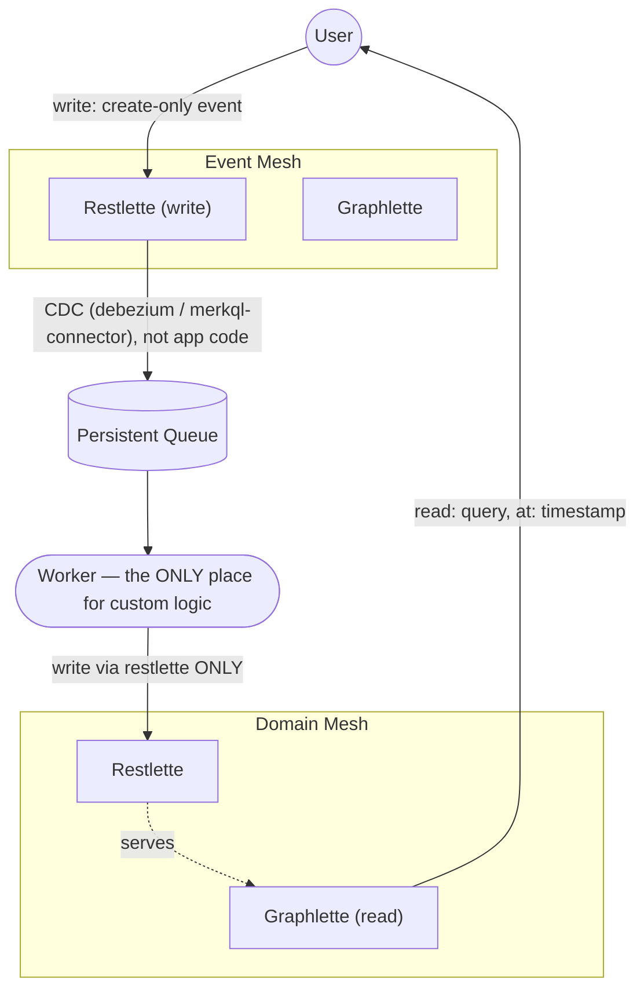

# Event mesh vs. domain mesh

Some meshql deployments split their entities into two groups with different write/read rules. This doc defines the split, gives you the verbatim rules that govern it, and — because the manifest can't tell you which group an entity is in — gives you a process for figuring it out.

## Definitions

A **meshlette** is one entity's Restlette+Graphlette pair over a shared store — e.g. `coop`'s restlette (`/coop/api`) and graphlette (`/coop/graph`) together are the `coop` meshlette. The rules below are stated per-meshlette; "Meshlettes MUST emit events to the queue" means every individual entity's pair does this, not the deployment as a whole.

- **Event mesh**: meshlettes that are **create-only**. Users write to them directly (that's the *only* kind of write a user makes). A CDC connector — never application code — picks up committed writes and emits them onto a queue.
- **Domain mesh**: meshlettes that hold **derived, queryable state**. A **Worker** consumes events off the queue and writes the resulting domain model via the domain meshlette's restlette. Users read domain meshlettes; they never write to them directly, and they never read event meshlettes for anything but confirming their own write happened.

"Event mesh" and "domain mesh" each contain several meshlettes — this is a per-entity property, not a deployment-wide toggle.

## The architecture

## The rules, verbatim

> The WORKER is the ONLY place you should be building custom logic.
> EVERY OTHER COMPONENT is configured, not customized.
>
> Users SHOULD update via the event restlettes
> Users SHOULD access via the domain graphlettes
> Meshlettes MUST emit events to the queue
> Meshlettes MUST emit events via CDC against their store (debezium / merkql-connector) NOT in code (single writer / single transaction)
> Meshlettes CAN share a common database
> Meshlettes CAN use a common language
> Meshlettes MUST emit a common event shape to the queue
> Workers MUST consume events
> Workers CAN consume multiple events
> Workers MUST update their meshlette via restlette ONLY
> Workers CAN use the graph API
> Workers CAN persist their own data
> Workers CAN persist data in their own meshlettes
> Workers SHOULD be one per meshlette
> Workers CAN make external calls
>
> Time is a FIRST CLASS concern. When graph requests are forwarded they do so with the timestamp of the originating query and IGNORE updates that happen in flight.
> No component should be tightly bound to another.
>   An event being down should not bring down a worker, just affect timeliness
>   A worker being down should not bring down a meshlette, just affect timeliness
>   The queue being down doesn't affect service availability, just the timeliness of the data
> ALL components must be able to recover from outages
> ALL meshlettes and queue MUST scale horizontally
> Workers CAN scale horizontally

This is a **recommended pattern, not a technology requirement** — nothing in meshql enforces it, the same way nothing in a web framework enforces MVC. Follow it when a deployment is built this way; don't assume every meshql deployment is structured this way, and don't force event/domain ceremony onto an entity that's just doing plain CRUD.

**This "don't force it" guidance is about consuming or reading an already-built deployment — it is not license to skip event-sourcing when you're the one designing a new backend from scratch.** If you're building both the backend and the frontend in the same task (not just writing a frontend against something someone else already built), the decision about which entities should be events vs. domain projections is governed by `meshql-patterns`' `references/domain-design.md`, whose own opening line calls this "the pattern meshql is built for" — a considerably stronger stance than "recommended, don't force it." Read that file before treating "plain CRUD for everything" as a neutral default; it usually isn't one. This distinction matters because it's easy to conflate the two: a sentence that's correct advice for a consumer ("don't invent structure that isn't there") reads, out of context, like permission for a designer to skip structure that should be there.

## Detecting the split — the manifest doesn't label it

The manifest lists entities and their surfaces; it does not say "this one is event-mesh." That relationship lives inside the Worker's code, which isn't published anywhere. Determine it in this order:

1. **Check the deployment's own documentation first.** A deployment built with this pattern usually says so in prose, because it isn't machine-readable elsewhere. Example — the `meshobj` (TypeScript) implementation's `examples/farm` README documents its own `lay_report`/`hen_productivity` split this way (quoted verbatim as an illustration of what to look for; this specific README doesn't exist in every implementation's copy of `examples/farm`):

   > **`lay_report`** (`POST /lay_report/api`) is a domain event, not a mutable record: `{henId, eggs, timeOfDay}`. It's create-only — `PUT`/`DELETE` against `/lay_report/api/:id` are rejected (`403`) for every caller. A correction, if ever needed, is a new event, not an edit.
   > **`hen_productivity`** (`/hen_productivity/api`, `/hen_productivity/graph`) is a read model folded from `lay_report` events — `{henId, totalEggs, lastLaidAt}`. It's an ordinary restlette+graphlette pair like every other entity here; what's unusual is *who* writes to it: only a `worker`-role caller (simulating the CDC-driven worker described in the `merkql-worker-pipeline` companion spec, which is out of scope for this TS example) may `create`/`update` it. Every other caller gets `403` on every verb.

   If the deployment you're targeting has no such doc, that's not evidence the pattern isn't in use — move on to behavioral probing.

2. **Failing that, probe behavior.** Attempt a `PUT` or `DELETE` against the entity's restlette (on a throwaway record, if you're not sure) — a `403` is a strong signal the entity is create-only by design, not by accident. Check whether its JSON Schema forbids fields an update would need to change.

3. **Failing that, ask.** Don't guess silently and build against the wrong assumption — a plain CRUD entity mistaken for an event, or vice versa, produces a frontend that writes to the wrong place.

This whole detection process only matters when the pattern is actually in use. A plain CRUD entity with no create-only restriction is just plain CRUD — read and write it directly, no event/domain ceremony required.
