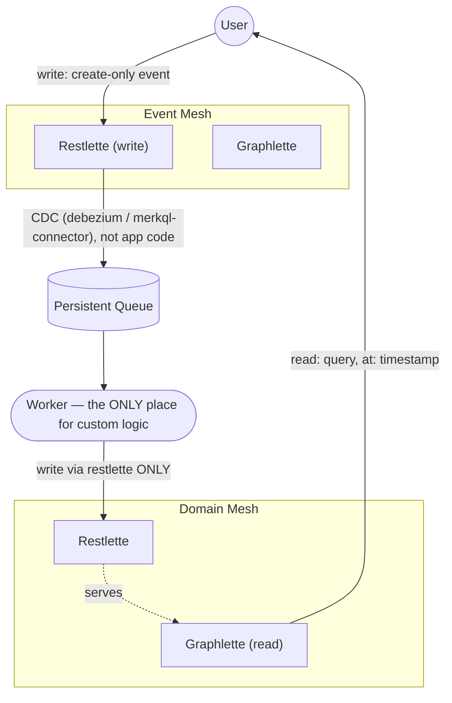

# meshql-iron Skill Implementation Plan

> **For agentic workers:** REQUIRED SUB-SKILL: Use superpowers:subagent-driven-development (recommended) or superpowers:executing-plans to implement this plan task-by-task. Steps use checkbox (`- [ ]`) syntax for tracking.

**Goal:** Author the `meshql-iron` Claude Code Skill — a pure-markdown instructional skill teaching an LLM agent how to build a frontend against a meshql deployment — and install it identically in `meshql-rs`, `meshql`, and `meshobj`.

**Architecture:** One `SKILL.md` + four `references/*.md` files (`manifest-discovery.md`, `event-vs-domain-mesh.md`, `honesty.md`, `worked-example.md`), written once against `meshql-rs` (the fully-verified reference implementation), then copied into `meshql` and `meshobj` with only the citations in `honesty.md` changed to point at each repo's own source files. No running code, no package, no build step — this is documentation that Claude Code auto-loads via YAML frontmatter when a task looks like frontend/client work against meshql.

**Tech Stack:** Markdown, YAML frontmatter, a Mermaid diagram, and one real vanilla-JS/HTML worked example (no framework, no build step, per the user's standing frontend conventions).

**Grounding facts verified before writing this plan** (do not re-verify — these are settled):
- `X-Meshql-Created-At`/`X-Meshql-Deleted` REST headers and opt-in `createdAt` GraphQL field exist on **all three** backends' `main` branches: Rust (`meshql-restlette/src/routes.rs`), Java (`api/restlette/src/main/java/com/meshql/api/restlette/CrudHandler.java:269-272`), TypeScript (`core/restlette/src/crud.ts:54-58`). No hedging needed in `honesty.md` — just per-repo citations.
- The event-sourced `lay_report`/`hen_productivity` shape (the pair `worked-example.md` is grounded in) is **not on any repo's `main`** — it exists on `merkql-worker-pipeline` (meshql-rs), `farm-retrofit-java` (meshql), `farm-retrofit-ts` (meshobj), none yet merged. Existing worktrees are already checked out at `meshql/.worktrees/farm-retrofit-java` and `meshobj/.worktrees/farm-retrofit-ts`; meshql-rs has no worktree for `merkql-worker-pipeline` (branch exists, not currently checked out anywhere).
- All three `examples/farm` deployments (once on their event-sourced branch) run on port `3033`.
- The manifest schema/shape is identical across backends by construction (manifest-parity project). Rust's manifest uses entity-named queries (`getLayReportsByHen`); Java's retrofit branch uses the generic dialect (`getByHen`) instead — confirmed by direct inspection. This is real, useful variation for `manifest-discovery.md` to call out: **never hardcode query names, always read them from the manifest's SDL**.
- TS's `farm-retrofit-ts` branch README (`examples/farm/README.md`) already documents `lay_report` as create-only with `PUT`/`DELETE` returning `403` for every caller, and `hen_productivity` writable only by a `worker`-role caller — real, load-bearing prior art for `event-vs-domain-mesh.md`'s detection heuristic.
- The skill installs to `.claude/skills/meshql-iron/` on each repo's primary checkout (`meshql-rs`, `meshql`, `meshobj` — their `main`-branch working directories, not the feature-branch worktrees), since that's the enduring location Claude Code loads skills from regardless of which branch is later checked out there.

---

## File Structure

```
meshql-rs/.claude/skills/meshql-iron/
├── SKILL.md
└── references/
    ├── manifest-discovery.md
    ├── event-vs-domain-mesh.md
    ├── honesty.md
    └── worked-example.md

meshql/.claude/skills/meshql-iron/       (same 5 files — honesty.md differs)
meshobj/.claude/skills/meshql-iron/      (same 5 files — honesty.md differs)
```

`meshql-rs`'s copy is written first, in full, and is the canonical version. `meshql` and `meshobj`'s copies are then produced by copying those 5 files verbatim and applying one small, exact patch to `honesty.md` (different source-file citations per backend language). `SKILL.md`, `manifest-discovery.md`, `event-vs-domain-mesh.md`, and `worked-example.md` are backend-language-agnostic (they describe HTTP surfaces and frontend code, not server implementation) and need **zero changes** across the three installations.

---

### Task 1: `meshql-rs` — `SKILL.md`

**Files:**
- Create: `meshql-rs/.claude/skills/meshql-iron/SKILL.md`

- [ ] **Step 1: Create the directory and write the file**

```bash
mkdir -p /tank/repos/tailoredshapes/meshql-rs/.claude/skills/meshql-iron/references
```

Write `meshql-rs/.claude/skills/meshql-iron/SKILL.md`:

```markdown
---
name: meshql-iron
description: Build a frontend or API client against a meshql deployment. Use when writing UI code, a client library, or any consumer that reads from and writes to a meshql-backed service (REST restlettes + GraphQL graphlettes). Covers manifest discovery, the event-mesh/domain-mesh convention, and "honesty" freshness timestamps.
---

# meshql-iron: building a frontend against meshql

`meshql-iron` is the frontend-consumption counterpart to `meshql-patterns` (which teaches how to *build* a meshql deployment). Use this skill whenever the task is building a UI, a client library, or any other consumer of an already-running meshql deployment — not when you're adding entities or endpoints to the deployment itself.

## The core principle, in one paragraph

Every meshql entity is a **meshlette**: a Restlette (`POST`/`PUT`/`DELETE /<entity>/api`, JSON Schema-validated writes) paired with a Graphlette (`/<entity>/graph`, GraphQL reads) over the same store. **Write via the restlette. Read via the graphlette.** Some deployments additionally split entities into an **event mesh** (create-only, projected by a worker into a separate entity) and a **domain mesh** (directly queryable) — when that's true, write to the event restlette and read from the domain graphlette, never the other way around. See `references/event-vs-domain-mesh.md` for how to recognize this and why it matters. Every response also carries "honesty" freshness metadata — an `X-Meshql-Created-At` REST header and an opt-in `createdAt` GraphQL field — so you can tell whether a read reflects a write you just made, instead of silently rendering stale data. See `references/honesty.md`.

## Getting started: discover the deployment

Don't hand-write requests against guessed shapes. Fetch `GET /manifest` first — every meshql deployment self-describes there: every entity, its GraphQL SDL, and its JSON Schema for writes. Read it the way you'd read any API document, and derive the correct calls from what it actually says, not from what a similar-looking deployment did last time. See `references/manifest-discovery.md`.

## Decision guide

- **Discovering what a deployment exposes** (entities, queries, write schemas) → read `references/manifest-discovery.md`
- **Deciding whether to write to entity X directly, or to some other event entity that feeds it** → read `references/event-vs-domain-mesh.md`
- **Showing a "pending"/"saved" state, or deciding whether a read reflects a write you just made** → read `references/honesty.md`
- **Seeing it all put together** → read `references/worked-example.md`, a real vanilla-JS walkthrough against `examples/farm`

## Non-goals — don't reach for these

- No SSE/`/changes` stream consumption. Treat push notifications as a future, separate module if a deployment ever needs them; nothing here depends on them.
- No generated or compiled client package. Read the manifest and write plain `fetch` calls — there's no codegen step and nothing to `npm install`.
- No reactive store, no subscribe/notify machinery. A cache here is just a `fetch` you haven't repeated yet, not a framework.
- Don't force an event/domain split onto an entity that's plain CRUD. Only apply `event-vs-domain-mesh.md` when the deployment actually uses that pattern — see its detection heuristic before assuming it does.
```

- [ ] **Step 2: Verify frontmatter parses**

Run: `python3 -c "import yaml,re; s=open('/tank/repos/tailoredshapes/meshql-rs/.claude/skills/meshql-iron/SKILL.md').read(); fm=re.match(r'^---\n(.*?)\n---', s, re.S).group(1); d=yaml.safe_load(fm); assert set(d) == {'name','description'}, d; print('OK', d['name'])"`

Expected: `OK meshql-iron` (install pyyaml first if missing: `pip install --user pyyaml` or use `python3 -c "import json"`-free manual check if pyyaml isn't available — at minimum confirm the file starts with `---`, has a `name:` and `description:` line, and a closing `---` before the first `#` heading).

- [ ] **Step 3: Commit**

```bash
cd /tank/repos/tailoredshapes/meshql-rs
git add .claude/skills/meshql-iron/SKILL.md
git commit -m "meshql-iron: add SKILL.md entry point"
```

---

### Task 2: `meshql-rs` — `references/manifest-discovery.md`

**Files:**
- Create: `meshql-rs/.claude/skills/meshql-iron/references/manifest-discovery.md`

- [ ] **Step 1: Write the file**

```markdown
# Discovering a meshql deployment via `/manifest`

Every meshql deployment self-describes at `GET /manifest`. Fetch it before writing any request against a guessed URL or payload shape — it's the source of truth for a running deployment, not documentation that can drift from it.

## Shape

```json
{
  "meshql": 1,
  "entities": {
    "<entity>": {
      "surfaces": {
        "graph": { "kind": "graphql", "path": "/<entity>/graph", "schema": "<SDL text>" },
        "api":   { "kind": "rest",    "path": "/<entity>/api",   "schema": { "...JSON Schema..." } }
      }
    }
  }
}
```

Real example, from `examples/farm`'s `coop` entity (trimmed):

```json
"coop": {
  "surfaces": {
    "graph": {
      "kind": "graphql",
      "path": "/coop/graph",
      "schema": "type Coop {\n    id: ID\n    farmId: String\n    name: String\n    capacity: Int\n    farm: Farm\n    hens: [Hen]\n}\n\ntype Query {\n    getCoop(id: ID, at: Float): Coop\n    getCoops(name: String, at: Float): [Coop]\n    getCoopsByFarm(id: ID, at: Float): [Coop]\n}\n"
    },
    "api": {
      "kind": "rest",
      "path": "/coop/api",
      "schema": {
        "type": "object",
        "properties": { "farmId": {"type": "string"}, "name": {"type": "string"}, "capacity": {"type": "integer"} },
        "required": ["farmId", "name"]
      }
    }
  }
}
```

## How to use each surface

- **`kind: "graphql"`** — `schema` is raw SDL text. Read it for the available `Query` fields, their arguments, and return types. Every query takes `at: Float` (epoch millis) for point-in-time reads — omit it (or pass the current time) for "now." `POST <path>` with a standard GraphQL `{ query, variables }` body.
- **`kind: "rest"`** — `schema` is the JSON Schema the write payload must satisfy. `POST <path>` to create, `PUT <path>/<id>` to update, `DELETE <path>/<id>` to remove. `required` is the minimum payload; validate a form against it the same way you'd validate against any JSON Schema.

## Query names are not a fixed vocabulary — read them

Two meshql deployments backing the identical entity shape can name their GraphQL queries differently. One service might expose `getLayReport(id)` / `getLayReportsByHen(id)` (entity-named); another might expose `getById(id)` / `getByHen(id)` (generic — used when a deployment wants to be auto-derivable by `meshql-mcp`). **Never hardcode a query name from a different deployment or from memory** — the manifest's SDL for *this* deployment is the only place that's guaranteed accurate. If a query you expect isn't in the schema, it doesn't exist here; look for the deployment's actual name for it instead of assuming it was omitted by mistake.

The same caution applies to payload field casing — most examples in this ecosystem use camelCase (`henId`, `farmId`), but don't assume it; read it from the JSON Schema's `properties`.

## URL construction

Paths in the manifest are already absolute (`/coop/graph`, `/coop/api`) — use them directly. If you ever need to construct one by convention instead of from a cached manifest, the fixed rule every implementation follows is `/{entity}/graph` and `/{entity}/api`, snake_case entity name.

## Stability

This doc is stable because the manifest schema itself (`schemas/manifest.schema.json`, `"meshql": 1` in every document) is stable and versioned. A deployment that changes its entity shapes changes what the manifest reports — it doesn't require a different fetching strategy on your end.
```

- [ ] **Step 2: Commit**

```bash
cd /tank/repos/tailoredshapes/meshql-rs
git add .claude/skills/meshql-iron/references/manifest-discovery.md
git commit -m "meshql-iron: add manifest-discovery reference"
```

---

### Task 3: `meshql-rs` — `references/event-vs-domain-mesh.md`

**Files:**
- Create: `meshql-rs/.claude/skills/meshql-iron/references/event-vs-domain-mesh.md`

- [ ] **Step 1: Write the file**

```markdown
# Event mesh vs. domain mesh

Some meshql deployments split their entities into two groups with different write/read rules. This doc defines the split, gives you the verbatim rules that govern it, and — because the manifest can't tell you which group an entity is in — gives you a process for figuring it out.

## Definitions

A **meshlette** is one entity's Restlette+Graphlette pair over a shared store — e.g. `coop`'s restlette (`/coop/api`) and graphlette (`/coop/graph`) together are the `coop` meshlette. The rules below are stated per-meshlette; "Meshlettes MUST emit events to the queue" means every individual entity's pair does this, not the deployment as a whole.

- **Event mesh**: meshlettes that are **create-only**. Users write to them directly (that's the *only* kind of write a user makes). A CDC connector — never application code — picks up committed writes and emits them onto a queue.
- **Domain mesh**: meshlettes that hold **derived, queryable state**. A **Worker** consumes events off the queue and writes the resulting domain model via the domain meshlette's restlette. Users read domain meshlettes; they never write to them directly, and they never read event meshlettes for anything but confirming their own write happened.

"Event mesh" and "domain mesh" each contain several meshlettes — this is a per-entity property, not a deployment-wide toggle.

## The architecture



## The rules, verbatim

> The WORKER is the ONLY place you should be building custom logic.
> EVERY OTHER COMPONENT is configured, not customized.
>
> Users SHOULD update via the event restlettes
> Users SHOULD access via the domain graphlettes
> Meshlettes MUST emit events to the queue
> Meshlettes MUST emit events via CDC against their store (debezium / merkql-connector) NOT in code (single writer / single transaction)
> Meshlettes CAN share a common database
> Meshlettes CAN use a common language
> Meshlettes MUST emit a common event shape to the queue
> Workers MUST consume events
> Workers CAN consume multiple events
> Workers MUST update their meshlette via restlette ONLY
> Workers CAN use the graph API
> Workers CAN persist their own data
> Workers CAN persist data in their own meshlettes
> Workers SHOULD be one per meshlette
> Workers CAN make external calls
>
> Time is a FIRST CLASS concern. When graph requests are forwarded they do so with the timestamp of the originating query and IGNORE updates that happen in flight.
> No component should be tightly bound to another.
>   An event being down should not bring down a worker, just affect timeliness
>   A worker being down should not bring down a meshlette, just affect timeliness
>   The queue being down doesn't affect service availability, just the timeliness of the data
> ALL components must be able to recover from outages
> ALL meshlettes and queue MUST scale horizontally
> Workers CAN scale horizontally

This is a **recommended pattern, not a technology requirement** — nothing in meshql enforces it, the same way nothing in a web framework enforces MVC. Follow it when a deployment is built this way; don't assume every meshql deployment is structured this way, and don't force event/domain ceremony onto an entity that's just doing plain CRUD.

## Detecting the split — the manifest doesn't label it

The manifest lists entities and their surfaces; it does not say "this one is event-mesh." That relationship lives inside the Worker's code, which isn't published anywhere. Determine it in this order:

1. **Check the deployment's own documentation first.** A deployment built with this pattern usually says so in prose, because it isn't machine-readable elsewhere. Example, verbatim from `examples/farm`'s README on the branch that has this shape:

   > `lay_report` (`POST /lay_report/api`) is a domain event, not a mutable record... It's create-only — `PUT`/`DELETE` against `/lay_report/api/:id` are rejected (`403`) for every caller.
   > `hen_productivity` is a read model folded from `lay_report` events... what's unusual is *who* writes to it: only a `worker`-role caller... can write to it.

2. **Failing that, probe behavior.** Attempt a `PUT` or `DELETE` against the entity's restlette (on a throwaway record, if you're not sure) — a `403` is a strong signal the entity is create-only by design, not by accident. Check whether its JSON Schema forbids fields an update would need to change.

3. **Failing that, ask.** Don't guess silently and build against the wrong assumption — a plain CRUD entity mistaken for an event, or vice versa, produces a frontend that writes to the wrong place.

This whole detection process only matters when the pattern is actually in use. A plain CRUD entity with no create-only restriction is just plain CRUD — read and write it directly, no event/domain ceremony required.
```

- [ ] **Step 2: Commit**

```bash
cd /tank/repos/tailoredshapes/meshql-rs
git add .claude/skills/meshql-iron/references/event-vs-domain-mesh.md
git commit -m "meshql-iron: add event-vs-domain-mesh reference"
```

---

### Task 4: `meshql-rs` — `references/honesty.md`

**Files:**
- Create: `meshql-rs/.claude/skills/meshql-iron/references/honesty.md`

- [ ] **Step 1: Write the file**

```markdown
# Honesty: telling whether a read reflects your write

meshql never widens the JSON body to expose its internal Envelope (`id`, `createdAt`, `deleted`, `authorizedTokens` stay internal by design), but it does leak exactly two freshness signals — deliberately — so a frontend can tell how fresh a payload is instead of silently rendering stale data.

## The two mechanisms

- **REST**: `create`, `read`, and `update` responses carry an `X-Meshql-Created-At` header (RFC3339 timestamp) and an `X-Meshql-Deleted` header (`true`/`false`). Automatic, no configuration. Not present on `list` (one header can't represent many records) or `delete` (there's no Envelope left to read a timestamp from — deletion is a tombstone write, and the delete endpoint returns only a boolean). Implemented in `meshql-restlette/src/routes.rs`.
- **GraphQL**: every Searcher merges `createdAt` (RFC3339) into the returned record next to `id`. A type opts in just by declaring `createdAt: String` in its schema — no resolver code needed, and a type that doesn't declare it simply never exposes the field. `deleted` is never exposed in GraphQL; search results already exclude deleted/superseded versions, so there's nothing to leak.

## Case 1: same-entity read-your-writes

You wrote a `coop` and want to know whether a subsequent read reflects that write. This is a clean, mechanical comparison — *if the type opts into `createdAt`*:

```js
const writeRes = await fetch(`${BASE}/coop/api`, { method: 'POST', /* ... */ });
const writtenAt = writeRes.headers.get('X-Meshql-Created-At');

const readRes = await fetch(`${BASE}/coop/graph`, {
  method: 'POST',
  headers: { 'Content-Type': 'application/json' },
  body: JSON.stringify({ query: `{ getCoop(id: "${id}") { id createdAt } }` }),
});
const { data } = await readRes.json();

const isFresh = data.getCoop && new Date(data.getCoop.createdAt) >= new Date(writtenAt);
```

If `isFresh` is false, the read predates your write — show a pending state and refetch rather than rendering what you got.

**Before relying on this, confirm the type actually declares `createdAt`** — it's opt-in per type, and none of the shipped `examples/farm` GraphQL schemas currently do (check the manifest's SDL for the type, per `manifest-discovery.md`, rather than assuming). If it isn't declared, you only have the REST write-side timestamp — enough to know *when* you wrote, not enough to mechanically confirm a specific read reflects it.

## Case 2: cross-entity / projection freshness

You wrote a `lay_report` (an event) and care about `hen_productivity` (a projection derived from it by a worker — see `event-vs-domain-mesh.md`). **No direct timestamp comparison is possible here** — the write and the projection are different records entirely, and the manifest has no way to encode that one feeds the other; that relationship lives inside the worker's code, not in anything published.

The guidance here is a pragmatic heuristic, not a mechanism:

1. After the write, show a pending/"recording…" affordance — don't render the old projection value as if it were current.
2. Refetch the projection (`hen_productivity`, in this example) — either once after a short delay, or a few times with a short interval.
3. Expect it to resolve within a read or two. The common case is a worker that processes an event faster than a page refresh takes to happen, not a system that needs sophisticated retry/backoff logic.
4. If the projection has its own domain timestamp field (e.g. `hen_productivity.lastLaidAt`, a payload field the worker sets — distinct from the honesty `createdAt` mechanism above), you can compare *that* against your write's `X-Meshql-Created-At` for a real, if domain-specific, freshness signal. This isn't the honesty mechanism reused generically — it's this particular projection happening to carry a timestamp that means something similar. Don't assume every projection has one.

This is the same pattern as this codebase's global frontend conventions: pending state, let the user refresh, never silently render stale data. Nothing here is meshql-specific beyond *what* to refetch and *why* a generic timestamp comparison doesn't apply.
```

- [ ] **Step 2: Commit**

```bash
cd /tank/repos/tailoredshapes/meshql-rs
git add .claude/skills/meshql-iron/references/honesty.md
git commit -m "meshql-iron: add honesty reference"
```

---

### Task 5: `meshql-rs` — `references/worked-example.md`

**Files:**
- Create: `meshql-rs/.claude/skills/meshql-iron/references/worked-example.md`

- [ ] **Step 1: Write the file**

```markdown
# Worked example: a minimal farm frontend

A single, concrete walkthrough grounded in `examples/farm` — the deployment this project built out with a full event/domain split (`lay_report` event feeding a `hen_productivity` projection) across all three meshql backends. Real vanilla JS/HTML, no framework, no build step, per this project's standing frontend conventions.

**Note on which branch has this shape:** as of this writing, `lay_report`/`hen_productivity` exist on `merkql-worker-pipeline` (this repo), `farm-retrofit-java`, and `farm-retrofit-ts` — not yet on any repo's `main`. Check whether that's since changed; if the entities aren't in `main`'s `/manifest`, run against the feature branch instead.

## Step 1: fetch the manifest, identify the split

```bash
curl -s http://localhost:3033/manifest | jq '.entities | keys'
# ["coop", "farm", "hen", "hen_productivity", "lay_report"]
```

Per `event-vs-domain-mesh.md`'s detection process: `examples/farm`'s own docs describe `lay_report` as create-only (event-mesh) and `hen_productivity` as worker-maintained (domain-mesh). This deployment's manifest (entity-named dialect) exposes:

- `lay_report`: `getLayReport(id, at)`, `getLayReports(at)`, `getLayReportsByHen(id, at)` — reads, plus `POST /lay_report/api` to write.
- `hen_productivity`: `getHenProductivity(id, at)`, `getHenProductivities(at)`, `getHenProductivityByHen(id, at)` — reads only, from a frontend's perspective; writes come from the worker, not from us.

(A different deployment might expose these under the generic dialect — `getById`/`getByHen` — instead. Always confirm against the actual manifest response; see `manifest-discovery.md`.)

## Step 2: the page

```html
<!doctype html>
<html lang="en">
<head>
  <meta charset="utf-8">
  <title>Farm — Lay Reports</title>
</head>
<body>
  <main>
    <h1>Record a lay report</h1>

    <section aria-labelledby="hens-heading">
      <h2 id="hens-heading">Hens</h2>
      <ul id="hen-list"></ul>
    </section>

    <form id="lay-report-form">
      <label for="hen-select">Hen</label>
      <select id="hen-select" name="henId" required></select>

      <label for="eggs">Eggs</label>
      <input id="eggs" name="eggs" type="number" min="0" required>

      <label for="time-of-day">Time of day</label>
      <input id="time-of-day" name="timeOfDay" type="datetime-local" required>

      <button type="submit">Record</button>
    </form>

    <p id="status" role="status" aria-live="polite"></p>
  </main>

  <script type="module" src="./app.js"></script>
</body>
</html>
```

## Step 3: the logic

```js
// app.js — vanilla ES module, no build step, no framework.
const BASE = 'http://localhost:3033';

const henSelect = document.getElementById('hen-select');
const henList = document.getElementById('hen-list');
const form = document.getElementById('lay-report-form');
const status = document.getElementById('status');

async function loadHens() {
  const res = await fetch(`${BASE}/hen/graph`, {
    method: 'POST',
    headers: { 'Content-Type': 'application/json' },
    body: JSON.stringify({ query: '{ getHens { id name } }' }),
  });
  const { data } = await res.json();

  henList.innerHTML = '';
  henSelect.innerHTML = '';
  for (const hen of data.getHens) {
    const li = document.createElement('li');
    li.textContent = hen.name;
    henList.appendChild(li);

    const option = document.createElement('option');
    option.value = hen.id;
    option.textContent = hen.name;
    henSelect.appendChild(option);
  }
}

async function getHenProductivity(henId) {
  const res = await fetch(`${BASE}/hen_productivity/graph`, {
    method: 'POST',
    headers: { 'Content-Type': 'application/json' },
    body: JSON.stringify({
      query: 'query($id: ID!) { getHenProductivityByHen(id: $id) { totalEggs lastLaidAt } }',
      variables: { id: henId },
    }),
  });
  const { data } = await res.json();
  return data.getHenProductivityByHen[0] ?? null;
}

form.addEventListener('submit', async (event) => {
  event.preventDefault();
  const henId = henSelect.value;
  const eggs = Number(document.getElementById('eggs').value);
  const timeOfDay = new Date(document.getElementById('time-of-day').value).toISOString();

  // lay_report is event-mesh: create-only, write via its restlette. Never PUT/DELETE it,
  // and never write hen_productivity directly — a worker derives it from this event.
  const writeRes = await fetch(`${BASE}/lay_report/api`, {
    method: 'POST',
    headers: { 'Content-Type': 'application/json' },
    body: JSON.stringify({ henId, eggs, timeOfDay }),
  });
  const writtenAt = writeRes.headers.get('X-Meshql-Created-At');

  status.textContent = 'Recording…';

  // hen_productivity is domain-mesh: read it via its own graphlette, not lay_report's.
  // The manifest has no structural link between the two entities — that relationship
  // lives in the worker, so freshness here is "refetch and compare," not a lookup
  // (see honesty.md, Case 2).
  const deadline = Date.now() + 5000;
  let productivity = null;
  while (Date.now() < deadline) {
    await new Promise((resolve) => setTimeout(resolve, 500));
    productivity = await getHenProductivity(henId);
    if (productivity?.lastLaidAt && new Date(productivity.lastLaidAt) >= new Date(writtenAt)) break;
  }

  status.textContent = (productivity?.lastLaidAt && new Date(productivity.lastLaidAt) >= new Date(writtenAt))
    ? `Recorded. ${productivity.totalEggs} eggs so far.`
    : 'Recorded — still catching up, refresh in a moment.';
});

loadHens();
```

## What this demonstrates

- **Manifest-driven discovery**: query names (`getHens`, `getHenProductivityByHen`) came from reading the manifest, not from memory of a similar deployment.
- **Event vs. domain routing**: the form writes to `/lay_report/api` (the event restlette) and never touches `/hen_productivity/api` — that entity is worker-only, per `event-vs-domain-mesh.md`.
- **Honesty in practice**: `X-Meshql-Created-At` from the write is compared against `hen_productivity.lastLaidAt` (a domain field the worker sets) to decide when to stop polling — the cross-entity heuristic from `honesty.md`, not a generic mechanism.
- **Standing frontend conventions**: semantic HTML (`<main>`, `<form>`, labeled inputs), an `aria-live="polite"` status region instead of silent DOM mutation, no framework, no build step.
```

- [ ] **Step 2: Sanity-check the JS is syntactically valid**

Extract the `app.js` code block to a scratch file and run:

```bash
node --check /tmp/claude-1000/-tank-repos-tailoredshapes/b34ec33e-3109-41dc-b5ed-da06c7353d6a/scratchpad/app-check.js
```

Expected: no output (syntax OK). Delete the scratch file afterward.

- [ ] **Step 3: Commit**

```bash
cd /tank/repos/tailoredshapes/meshql-rs
git add .claude/skills/meshql-iron/references/worked-example.md
git commit -m "meshql-iron: add worked-example reference"
```

---

### Task 6: Install in `meshql` (Java)

**Files:**
- Create: `meshql/.claude/skills/meshql-iron/SKILL.md` (copy of Task 1's file, unchanged)
- Create: `meshql/.claude/skills/meshql-iron/references/manifest-discovery.md` (copy of Task 2's file, unchanged)
- Create: `meshql/.claude/skills/meshql-iron/references/event-vs-domain-mesh.md` (copy of Task 3's file, unchanged)
- Create: `meshql/.claude/skills/meshql-iron/references/honesty.md` (copy of Task 4's file, **with the patch below applied**)
- Create: `meshql/.claude/skills/meshql-iron/references/worked-example.md` (copy of Task 5's file, unchanged)

- [ ] **Step 1: Copy the four unchanged files**

```bash
mkdir -p /tank/repos/tailoredshapes/meshql/.claude/skills/meshql-iron/references
cp /tank/repos/tailoredshapes/meshql-rs/.claude/skills/meshql-iron/SKILL.md \
   /tank/repos/tailoredshapes/meshql/.claude/skills/meshql-iron/SKILL.md
cp /tank/repos/tailoredshapes/meshql-rs/.claude/skills/meshql-iron/references/manifest-discovery.md \
   /tank/repos/tailoredshapes/meshql/.claude/skills/meshql-iron/references/manifest-discovery.md
cp /tank/repos/tailoredshapes/meshql-rs/.claude/skills/meshql-iron/references/event-vs-domain-mesh.md \
   /tank/repos/tailoredshapes/meshql/.claude/skills/meshql-iron/references/event-vs-domain-mesh.md
cp /tank/repos/tailoredshapes/meshql-rs/.claude/skills/meshql-iron/references/worked-example.md \
   /tank/repos/tailoredshapes/meshql/.claude/skills/meshql-iron/references/worked-example.md
```

- [ ] **Step 2: Copy `honesty.md` and patch the two source citations**

```bash
cp /tank/repos/tailoredshapes/meshql-rs/.claude/skills/meshql-iron/references/honesty.md \
   /tank/repos/tailoredshapes/meshql/.claude/skills/meshql-iron/references/honesty.md
```

In `meshql/.claude/skills/meshql-iron/references/honesty.md`, change the "The two mechanisms" bullet list's implementation citation from:

```markdown
- **REST**: ... Implemented in `meshql-restlette/src/routes.rs`.
```

to:

```markdown
- **REST**: ... Implemented in `api/restlette/src/main/java/com/meshql/api/restlette/CrudHandler.java` (`setHonestyHeaders`, called from create/read/update).
```

No other lines in `honesty.md` need to change — the GraphQL opt-in mechanism, both freshness cases, and the reasoning are backend-language-agnostic and identical for Java.

- [ ] **Step 3: Verify the patch and commit**

```bash
cd /tank/repos/tailoredshapes/meshql
grep -n "CrudHandler" .claude/skills/meshql-iron/references/honesty.md
```

Expected: one match, the citation line above.

```bash
git add .claude/skills/meshql-iron
git commit -m "meshql-iron: install skill (Java backend citations)"
```

---

### Task 7: Install in `meshobj` (TypeScript)

**Files:**
- Create: `meshobj/.claude/skills/meshql-iron/SKILL.md` (copy of Task 1's file, unchanged)
- Create: `meshobj/.claude/skills/meshql-iron/references/manifest-discovery.md` (copy of Task 2's file, unchanged)
- Create: `meshobj/.claude/skills/meshql-iron/references/event-vs-domain-mesh.md` (copy of Task 3's file, unchanged)
- Create: `meshobj/.claude/skills/meshql-iron/references/honesty.md` (copy of Task 4's file, **with the patch below applied**)
- Create: `meshobj/.claude/skills/meshql-iron/references/worked-example.md` (copy of Task 5's file, unchanged)

- [ ] **Step 1: Copy the four unchanged files**

```bash
mkdir -p /tank/repos/tailoredshapes/meshobj/.claude/skills/meshql-iron/references
cp /tank/repos/tailoredshapes/meshql-rs/.claude/skills/meshql-iron/SKILL.md \
   /tank/repos/tailoredshapes/meshobj/.claude/skills/meshql-iron/SKILL.md
cp /tank/repos/tailoredshapes/meshql-rs/.claude/skills/meshql-iron/references/manifest-discovery.md \
   /tank/repos/tailoredshapes/meshobj/.claude/skills/meshql-iron/references/manifest-discovery.md
cp /tank/repos/tailoredshapes/meshql-rs/.claude/skills/meshql-iron/references/event-vs-domain-mesh.md \
   /tank/repos/tailoredshapes/meshobj/.claude/skills/meshql-iron/references/event-vs-domain-mesh.md
cp /tank/repos/tailoredshapes/meshql-rs/.claude/skills/meshql-iron/references/worked-example.md \
   /tank/repos/tailoredshapes/meshobj/.claude/skills/meshql-iron/references/worked-example.md
```

- [ ] **Step 2: Copy `honesty.md` and patch the citation**

```bash
cp /tank/repos/tailoredshapes/meshql-rs/.claude/skills/meshql-iron/references/honesty.md \
   /tank/repos/tailoredshapes/meshobj/.claude/skills/meshql-iron/references/honesty.md
```

Change:

```markdown
- **REST**: ... Implemented in `meshql-restlette/src/routes.rs`.
```

to:

```markdown
- **REST**: ... Implemented in `core/restlette/src/crud.ts` (`setHonestyHeaders`, called from create/read/update).
```

- [ ] **Step 3: Verify the patch and commit**

```bash
cd /tank/repos/tailoredshapes/meshobj
grep -n "crud.ts" .claude/skills/meshql-iron/references/honesty.md
```

Expected: one match, the citation line above.

```bash
git add .claude/skills/meshql-iron
git commit -m "meshql-iron: install skill (TypeScript backend citations)"
```

---

### Task 8: Acceptance validation

This is prose an agent follows, not code with unit tests — reading it back to check it "sounds right" isn't a meaningful test. Validate the way the spec's Validation section describes: dispatch a fresh agent with **zero context beyond the skill itself**, pointed at a live `examples/farm` deployment that actually has the `lay_report`/`hen_productivity` split, and see whether the skill alone is sufficient to produce a correct frontend.

- [ ] **Step 1: Stand up a live deployment with the event-sourced shape**

Use whichever of the three backends is most convenient (they're equivalent for this test). For `meshql-rs`, from a checkout of `merkql-worker-pipeline` (check `main` first — if `lay_report`/`hen_productivity` have been merged since this plan was written, prefer `main`):

```bash
cd /tank/repos/tailoredshapes/meshql-rs
git worktree add /tmp/meshql-iron-validate merkql-worker-pipeline
cd /tmp/meshql-iron-validate/examples/farm
# start MongoDB per the crate's docker-compose / README, then:
cargo run
```

Confirm it's up: `curl -s http://localhost:3033/manifest | jq '.entities | keys'` should include `lay_report` and `hen_productivity`.

- [ ] **Step 2: Dispatch a fresh, context-free agent**

Use the Agent tool (general-purpose, no prior context from this session — do not paste in anything from this plan or the spec) with a prompt like:

> A meshql deployment is running at http://localhost:3033. The `meshql-iron` skill in this repo's `.claude/skills/` should have loaded automatically — if it hasn't, read `.claude/skills/meshql-iron/SKILL.md` first. Build a minimal HTML+JS page (no framework, no build step) that lists hens and lets the user submit a lay report, showing when the hen's productivity count updates. Save it under a scratch directory and report back what you built and why.

- [ ] **Step 3: Review the result**

Check specifically:
- Did it write to `/lay_report/api` (not `/hen_productivity/api`) for the new report?
- Did it read `hen_productivity` from its own graphlette, not assume it updates synchronously?
- Did it show *some* pending/loading state rather than silently freezing or rendering stale data?
- Did it discover query/field names from `/manifest` rather than guessing?

This is not pass/fail against exact code — it's whether the skill was *sufficient*, on its own, for a context-free agent to get the architecture right. If it gets something wrong, that's a gap in the skill content (usually `event-vs-domain-mesh.md` or `honesty.md`), not a bug in the test agent — fix the relevant reference doc and re-run.

- [ ] **Step 4: Tear down**

```bash
cd /tank/repos/tailoredshapes/meshql-rs
git worktree remove /tmp/meshql-iron-validate
```

No commit for this task — it's a review checkpoint, not a code change. If Step 3 finds a gap and you fix a reference doc, that fix gets its own commit in the relevant repo, and Steps 1-3 should be re-run once against the fix.
