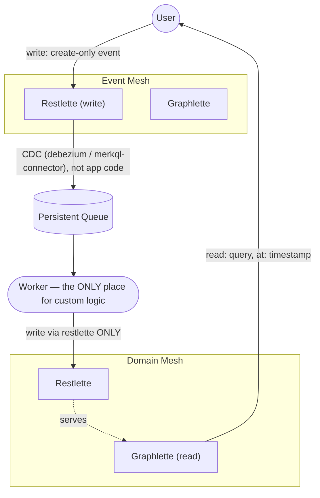

# meshql-iron: a frontend-consumption skill for meshql deployments

**Date:** 2026-07-23
**Status:** Approved design, pre-implementation
**Depends on:** nothing new — consumes work already merged and pushed: `meshql-changes` (manifest + honesty, `meshql-rs` main) and the manifest port to Java/TS (`docs/superpowers/plans/2026-07-22-manifest-parity.md`, landed on the `farm-retrofit-java`/`farm-retrofit-ts` branches, not yet pushed by the user as of this writing)
**Unblocks:** nothing downstream yet — this is the terminal piece of the "FE client" thread opened by `docs/superpowers/specs/2026-07-07-meshql-changes-design.md`

## Motivation

The 2026-07-07 `meshql-changes` design doc built two backend capabilities specifically to enable a planned frontend client: a self-describing deployment manifest (`/manifest`) and, in follow-on work, "honesty" freshness metadata (`X-Meshql-Created-At` REST header, `createdAt` GraphQL field, opt-in per type). That doc explicitly deferred the client itself as "a separate project, separate spec."

This project is that separate spec — but not the project originally imagined. Working through the design surfaced that the actual goal (quickly and correctly build a frontend against a meshql deployment, without re-deriving the event-mesh/domain-mesh architecture from scratch every time) is better served by an **instructional skill** than by a compiled TypeScript client library:

- A generated client needs either a runtime manifest-fetch (adds a startup pause) or a codegen step (adds a build step and a "regenerate on deploy" workflow) to get typed, per-entity bindings. An LLM agent doesn't need either — it reads `/manifest` the same way it reads any API document, at the point it needs to, and derives the right calls by reasoning rather than by generated code.
- The manifest doesn't encode which entities are event-mesh (create-only, projected by a worker) vs. domain-mesh (directly queryable) — that split is a recommended architectural pattern (see the diagram below), not a structural guarantee the technology enforces. A generated client would need to either hardcode this detection or ignore it; an agent can reason about it contextually — checking the deployment's own docs, then probing behavior, then asking — the way a competent engineer would.
- "Honesty" freshness (comparing a write's timestamp against a subsequent read's) is a reasoning pattern, not a mechanism that benefits from being enforced in library code. Once cross-entity/projection freshness entered the picture (writing an event, caring about a projection it feeds), it became clear there's no generic timestamp comparison that covers it — only a "give it a beat and refetch" heuristic that depends on knowing the projection relationship, which only the person building the frontend (or an agent reasoning about the deployment) actually has.
- The original design doc's "Redux-like store" framing assumed something would trigger cache invalidation. Without SSE (deliberately out of scope — see Non-Goals) and without client-side auto-polling, nothing does; the only thing that changes a cached read is the caller explicitly asking again. That's not a reactive store, it's a plain fetch-and-cache pattern — and once SSE is off the table, most of what made "Redux-like" the right framing goes with it.

What's left after removing all of that is exactly the thing worth building: **teach an agent the pattern once, so it never has to be re-explained.**

## Non-Goals

Explicitly out of scope for this project, and not stubbed or half-built:

- **SSE / `/changes` stream consumption.** Treated as a separate, optional module for later — analogous to a search-index integration that doesn't exist yet. Not referenced as a requirement anywhere in the skill content.
- **A compiled or generated TypeScript client package.** No `npm install`, no codegen CLI, no build step, no published artifact. This was the original framing (`meshql-iron` as a standalone repo shipping a library) and it's abandoned in favor of the skill.
- **A reactive/subscribable store.** No subscribe/notify machinery, no "Redux-like" API surface.
- **Automatic pending-state management or cross-entity dependency tracking in code.** The skill teaches an agent how to reason about freshness; it doesn't ship a runtime that enforces it.
- **Hardcoding the event-mesh/domain-mesh split as a technology requirement.** It's the user's preferred convention, and the skill teaches agents to recognize and honor it when present — but a plain CRUD entity with no such restriction is just plain CRUD, with no ceremony forced onto it.
- **A standalone `meshql-iron` repository.** Killed once the deliverable became a skill: a skill has no package to distribute, and repos are separate on-disk projects that each need their own copy for auto-loading to work (see Deliverable, below) — there's no shared-artifact benefit a fourth repo would provide.

## The architecture the skill teaches

This diagram (the user's own, refined during this design conversation) is the mental model every reference doc in the skill builds on:



Rule list, carried verbatim into `references/event-vs-domain-mesh.md` (not paraphrased — precision matters here):

> The WORKER is the ONLY place you should be building custom logic.
> EVERY OTHER COMPONENT is configured, not customized.
>
> Users SHOULD update via the event restlettes
> Users SHOULD access via the domain graphlettes
> Meshlettes MUST emit events to the queue
> Meshlettes MUST emit events via CDC against their store (debezium / merkql-connector) NOT in code (single writer / single transaction)
> Meshlettes CAN share a common database
> Meshlettes CAN use a common language
> Meshlettes MUST emit a common event shape to the queue
> Workers MUST consume events
> Workers CAN consume multiple events
> Workers MUST update their meshlette via restlette ONLY
> Workers CAN use the graph API
> Workers CAN persist their own data
> Workers CAN persist data in their own meshlettes
> Workers SHOULD be one per meshlette
> Workers CAN make external calls
>
> Time is a FIRST CLASS concern. When graph requests are forwarded they do so with the timestamp of the originating query and IGNORE updates that happen in flight.
> No component should be tightly bound to another.
>   An event being down should not bring down a worker, just affect timeliness
>   A worker being down should not bring down a meshlette, just affect timeliness
>   The queue being down doesn't affect service availability, just the timeliness of the data
> ALL components must be able to recover from outages
> ALL meshlettes and queue MUST scale horizontally
> Workers CAN scale horizontally

This is a *recommended* pattern, not a technology requirement — nothing in meshql enforces it, the same way nothing in a web framework enforces MVC. An agent following the skill recognizes it when a deployment is built this way and works with it correctly; it doesn't assume every meshql deployment is structured this way, and it doesn't force event/domain ceremony onto an entity that's just doing plain CRUD.

## Deliverable: three identical skill installations

Not one shared artifact — the skill's content is installed identically into each of the three implementation repos, because each is a separate on-disk project and Claude Code's project-scoped skill loading only picks up `.claude/skills/` from the repo currently being worked in:

```
meshql-rs/.claude/skills/meshql-iron/
meshql/.claude/skills/meshql-iron/
meshobj/.claude/skills/meshql-iron/
```

Each installation has the identical structure and (barring trivial per-repo path references) identical content, since the manifest shape, honesty fields, and event/domain-mesh pattern are the same across all three backends by design — that uniformity is exactly what the manifest-parity project (`2026-07-22-manifest-parity-design.md`) exists to guarantee.

```
.claude/skills/meshql-iron/
├── SKILL.md
└── references/
    ├── manifest-discovery.md
    ├── event-vs-domain-mesh.md
    ├── honesty.md
    └── worked-example.md
```

`meshql-iron` sits alongside each repo's existing backend-authoring skill (e.g. `meshql-patterns` in `meshql-rs`) as its frontend-consumption counterpart: one teaches how to build/extend a meshql deployment, the other teaches how to build a UI that correctly consumes one.

### `SKILL.md`

The entry point and the only thing loaded by default. Short trigger description — loads when the task is building a frontend or API client against a meshql deployment. A condensed version of the core principle (write via the event restlette, read via the domain graphlette, honesty timestamps tell you freshness) short enough to act on without opening a reference doc for the common case. A decision guide pointing into `references/` for depth, in the same style as `meshql-patterns`' own decision guide (e.g. "Discovering what a deployment exposes → read `manifest-discovery.md`. Distinguishing event vs. domain entities → read `event-vs-domain-mesh.md`.").

### `references/manifest-discovery.md`

Mechanical, low-risk content: fetch `/manifest`, walk `entities.<name>.surfaces`. A surface with `kind: "graphql"` carries SDL text — parse it for the available queries and their argument/return shapes. A surface with `kind: "rest"` carries a JSON Schema describing the write payload. Construct URLs by the fixed convention every implementation follows: `/{entity}/graph`, `/{entity}/api`. This doc is stable because the manifest schema itself (`schemas/manifest-v1.schema.json`) is stable and versioned.

### `references/event-vs-domain-mesh.md`

The conceptual core. Contains the diagram and rule list above verbatim, plus the honest treatment of a real gap: **the manifest does not structurally label which entities are event-mesh vs. domain-mesh.** Detection is a process, not a lookup:

1. Check the deployment's own documentation first — every `examples/farm` built this session documents its event/domain split in prose (e.g. "lay_report is create-only," "hen_productivity is worker-only writes") precisely because it isn't machine-readable elsewhere.
2. Failing that, probe behavior — does `PUT`/`DELETE` on the entity's restlette return 403? Does its JSON Schema forbid the shape an update would need?
3. Failing that, ask.

And the explicit caveat that this whole section only applies when the pattern is actually in use — a plain CRUD entity with no create-only restriction is just plain CRUD.

### `references/honesty.md`

The mechanics of `X-Meshql-Created-At` (REST, on create/read/update responses) and `createdAt` (GraphQL, opt-in per type — only selectable if the schema declares it). Two cases:

- **Same-entity read-your-writes** (wrote a `coop`, reading that `coop` back): a clean, mechanical comparison — if the read's `createdAt` is `>=` the write's `X-Meshql-Created-At`, the read reflects the write.
- **Cross-entity/projection freshness** (wrote `lay_report`, care about `hen_productivity`): no direct timestamp comparison is possible — the write and the projection are different records entirely, and the manifest has no way to encode that one feeds the other (same gap as above, same reason: that relationship lives inside the worker, not in anything published). Guidance here is a pragmatic heuristic, not a mechanism: show a pending/"recording..." affordance after the write, refetch the projection, and expect it to resolve within a read or two — the common case is a worker that processes faster than a page refresh, not a system that needs sophisticated retry/backoff logic. This doc points at the user's existing global frontend conventions (pending state, let the user refresh, never silently render stale data) rather than restating them.

### `references/worked-example.md`

A single, concrete, real-code walkthrough grounded in `examples/farm` — the one deployment this session built out with the full event/domain split (`lay_report`/`hen_productivity`) across all three languages, so it's a faithful proving ground regardless of which repo's copy of the skill is being read. Fetches `/manifest`, identifies `lay_report` as event-mesh and `hen_productivity` as domain-mesh, and builds a minimal vanilla-TS/DOM page: list hens, submit a lay report, show a pending affordance, refetch `hen_productivity`, display the result once it lands. Real code, following the user's standing frontend conventions (vanilla, semantic HTML, accessible, no framework) — not pseudocode.

## Validation

This is prose an agent follows, not code with unit tests — reading it back to check it "sounds right" isn't a meaningful test of whether it actually works for someone with no other context. The acceptance test: dispatch a fresh agent with **zero context beyond the skill itself**, pointed at a live, running `examples/farm` deployment (Rust's — already pushed and runnable without any push action from the user), with a task like "build a minimal page that lists hens and lets you submit a lay report, showing when the count updates." Review the result for whether it actually respects the event/domain split and handles honesty timestamps sensibly — not whether the agent could paraphrase the skill back, but whether the skill alone was sufficient to produce a correct frontend.

## Summary of what this design intentionally leaves open

- **SSE-driven invalidation** as a future, separate module, if it's ever built.
- **Extending the manifest schema** to explicitly label event-mesh vs. domain-mesh entities, which would remove the detection-heuristic section of `event-vs-domain-mesh.md` entirely if it ever happens — deliberately not pursued now because the split is a convention, not a technology requirement, and baking it into the schema would make it look like one.
- **A runnable companion app** alongside the skill (rather than just a worked-example doc) — the natural upgrade if the worked-example doc alone turns out not to be enough to reliably produce correct frontends during validation.
- **Honesty parity confirmation on Java/TS** — this design assumes the REST/GraphQL honesty fields exist identically on all three backends (matching the manifest-parity precedent), but that was not independently re-verified while writing this spec; worth a quick check before or during implementation.
